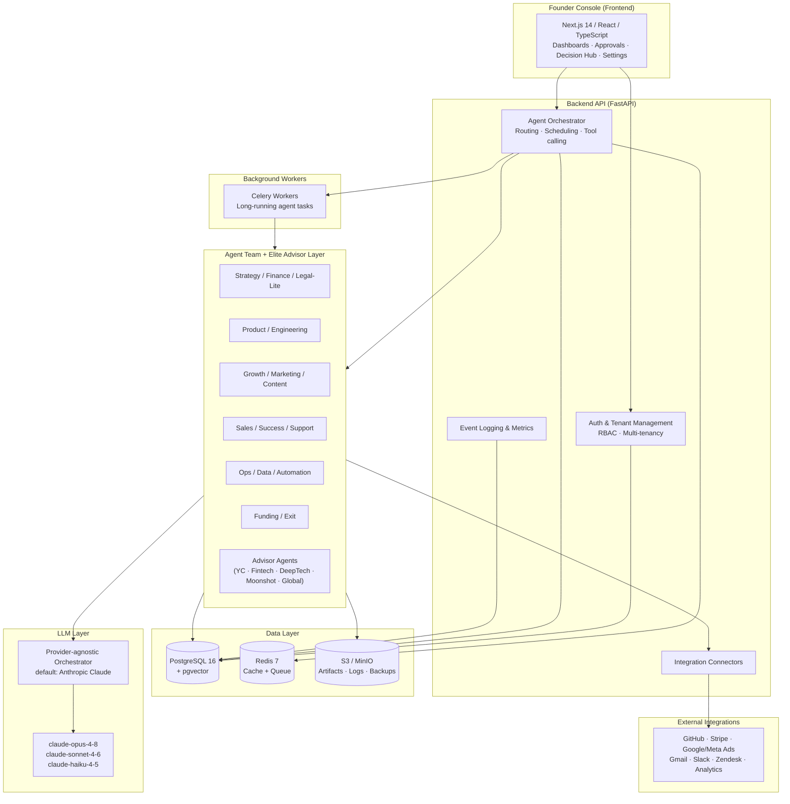

<!-- Badges placeholder -->
<p align="center">
  
  
  
  
  
  
</p>

# MyUNO Capital

> **The full virtual team for solo entrepreneurs: validate ideas, build, grow, and exit your business from one AI-powered platform.**

MyUNO Capital is an **Autonomous AI Operating System for solo entrepreneurs** that covers the entire business lifecycle — **idea → validation → build → grow → scale → exit**. It gives one person the leverage of a full founding team and staff: strategy, product, engineering, marketing, sales, support, finance, legal-lite, and exit planning, all orchestrated by a coordinated team of AI agents and supervised from a single console.

---

## What is MyUNO Capital

Solo founders carry the weight of an entire company alone — strategy, code, marketing, sales, support, finance, and admin — with limited capital and no co-founder to challenge assumptions. MyUNO Capital removes that ceiling.

The platform learns your goals, constraints, risk appetite, and working style, then composes a **virtual team of agents** that runs your business as a set of end-to-end workflows. You stay the founder and final decision-maker: you set goals and guardrails, approve important actions through configurable **Autonomy Profiles**, and can pause, adjust, or override at any time. Every significant agent and human action is logged for trust, debugging, compliance, and exit due diligence.

It is built to be **multi-tenant and multi-business**: run several companies in parallel, kill weak ideas early, double down on winners, and make each business **exit-ready by design**.

---

## Key Features

- **Full Agent Team** — A coordinated suite of specialized agents across the lifecycle:
  - *Strategy, Finance & Legal-Lite*: `IdeaValidationAgent`, `StrategyAgent`, `FinanceAgent`, `Legal/ComplianceAgent`
  - *Product & Engineering*: `ProductManagerAgent`, `ArchitectAgent`, `DevAgent`, `QAAgent`, `DevOpsAgent`
  - *Growth, Marketing & Content*: `MarketingStrategyAgent`, `AdsAgent`, `ContentAgent`, `SEOAgent`
  - *Sales, Success & Support*: `SalesAgent`, `SuccessAgent`, `SupportAgent`
  - *Operations, Data & Automation*: `OpsAgent`, `DataAgent`, `AutomationAgent`
  - *Funding & Exit*: `FundingReadinessAgent`, `ExitPlanningAgent`, `AcquirerOutreachAgent`, `WindDownAgent`
- **Elite Advisor & Accelerator Layer** — Advisor agents that encode proven playbooks: YC Accelerator Agent, Fintech/Product Excellence Agent (Tinkoff-like), Deep Tech Validation Agent (MIT-like), Moonshot Strategy Agent (Elon-like), and Global Ecosystem Builder Agent (Jack Ma-like).
- **Founder Console** — Your cockpit for multi-business management, goal & strategy setting, autonomy & approvals, and live dashboards (revenue, costs, profit, churn, NPS, exit-readiness).
- **Decision Hub** — A central place to compare options and decide with data, not gut feeling. Every major decision (ideas, features, channels, pricing, tech stacks) is scored on **Risk (0–100)**, **Complexity (0–100)**, **Potential (0–100)**, Time to Impact, and Capital Required — plus multi-angle advisor scores and recommendations.
- **Idea → Exit Lifecycle** — Structured stages (Ideation, Validate, Build, Launch, Grow, Scale, ExitPrep, Exit) with success criteria, **Pivot Triggers**, and advisor checkpoints at each stage.
- **Configurable Autonomy** — *Ask me first*, *Guided autonomy*, or *Autonomous within limits*, with budget and action guardrails (e.g., "Ask before spending > $100/day on ads", "Require approval for production deploys").
- **Integrations & Memory** — Connectors for GitHub, Stripe, Google Ads, Meta Ads, Gmail/Outlook, Slack, Intercom/Zendesk, analytics, and more, backed by short-term task memory, company-level memory, and a global activity log.

---

## High-Level Architecture



For a deeper view, see [docs/architecture.md](docs/architecture.md).

---

## Quick Start

Get a full local stack (frontend, backend, PostgreSQL + pgvector, Redis, MinIO) running with three commands:

```bash
git clone https://github.com/myuno-capital/myuno-capital.git
cd myuno-capital
cp .env.example .env        # then add your ANTHROPIC_API_KEY and any integration keys
docker compose up
```

Once the stack is up:

- Founder Console (frontend): http://localhost:3000
- Backend API + docs (Swagger UI): http://localhost:8000/docs
- MinIO console: http://localhost:9001

For full prerequisites, configuration, database migrations, and troubleshooting, read the [Getting Started guide](docs/getting-started.md).

---

## Repository Structure

```text
MyUNO-Capital/
├── frontend/              # Next.js 14 (App Router), React, TypeScript, Tailwind CSS
│   ├── app/               # App Router routes (console, dashboards, decision-hub)
│   ├── components/        # Reusable UI components
│   ├── lib/               # API clients, hooks, utilities
│   └── public/            # Static assets
├── backend/               # Python 3.12, FastAPI, SQLAlchemy 2.x, Pydantic v2
│   ├── app/
│   │   ├── api/           # FastAPI routers / endpoints
│   │   ├── agents/        # Agent implementations + orchestrator
│   │   ├── core/          # Config, security, settings
│   │   ├── models/        # SQLAlchemy models
│   │   ├── schemas/       # Pydantic schemas
│   │   ├── services/      # Business logic, integrations, scoring
│   │   └── workers/       # Celery tasks
│   ├── alembic/           # Database migrations
│   └── tests/             # Pytest suite
├── docs/                  # Project documentation (see table below)
├── infra/                 # Docker, Compose, Kubernetes manifests, CI/CD
├── .env.example           # Sample environment configuration
├── docker-compose.yml     # Local dev stack
├── README.md              # This file
├── CONTRIBUTING.md        # Contribution guidelines
├── CODE_OF_CONDUCT.md     # Community standards
└── LICENSE                # MIT License
```

---

## Documentation

| Document | Description |
|----------|-------------|
| [docs/index.md](docs/index.md) | Documentation home and table of contents. |
| [docs/overview.md](docs/overview.md) | Product vision, mission, and the idea→exit value proposition. |
| [docs/architecture.md](docs/architecture.md) | System design, services, multi-tenancy, and reliability targets. |
| [docs/getting-started.md](docs/getting-started.md) | Local setup, prerequisites, environment, and first run. |
| [docs/agents.md](docs/agents.md) | The full agent team and the Elite Advisor & Accelerator Layer. |
| [docs/decision-hub.md](docs/decision-hub.md) | Option scoring, Risk/Complexity/Potential formulas, and workflow. |
| [docs/data-model.md](docs/data-model.md) | Core entities, tenancy, and the data/memory layer. |
| [docs/api-reference.md](docs/api-reference.md) | REST API endpoints and conventions. |
| [docs/integrations.md](docs/integrations.md) | Supported third-party integrations and connectors. |
| [docs/deployment.md](docs/deployment.md) | Docker, Kubernetes, and CI/CD deployment guidance. |
| [docs/security-compliance.md](docs/security-compliance.md) | Security practices, privacy, and the compliance roadmap. |
| [docs/roadmap.md](docs/roadmap.md) | Stage map, milestones, and what's next. |
| [docs/glossary.md](docs/glossary.md) | Definitions of key terms and concepts. |
| [docs/faq.md](docs/faq.md) | Frequently asked questions. |

> Note: Some documents above are authored incrementally. This README, the contribution guides, the documentation index, the glossary, and the FAQ are available now; the remaining design docs are linked and being filled in.

---

## Tech Stack

| Layer | Technology |
|-------|------------|
| Frontend | Next.js 14 (App Router), React, TypeScript, Tailwind CSS |
| Backend | Python 3.12, FastAPI, SQLAlchemy 2.x, Alembic, Pydantic v2 |
| Database | PostgreSQL 16 with the pgvector extension |
| Queue / Cache | Redis 7; background workers via Celery |
| Object Storage | S3-compatible (MinIO for local dev) |
| LLM Layer | Provider-agnostic orchestrator, default provider Anthropic Claude (`claude-opus-4-8`, `claude-sonnet-4-6`, `claude-haiku-4-5`) |
| Containerization | Docker + Docker Compose (local), Kubernetes (production) |
| CI/CD | GitHub Actions |

---

## Contributing

Contributions are welcome. Please read [CONTRIBUTING.md](CONTRIBUTING.md) for the development workflow, branching model, code style, testing, and PR process, and review our [Code of Conduct](CODE_OF_CONDUCT.md).

---

## License

Released under the [MIT License](LICENSE). © 2026 MyUNO Capital.
