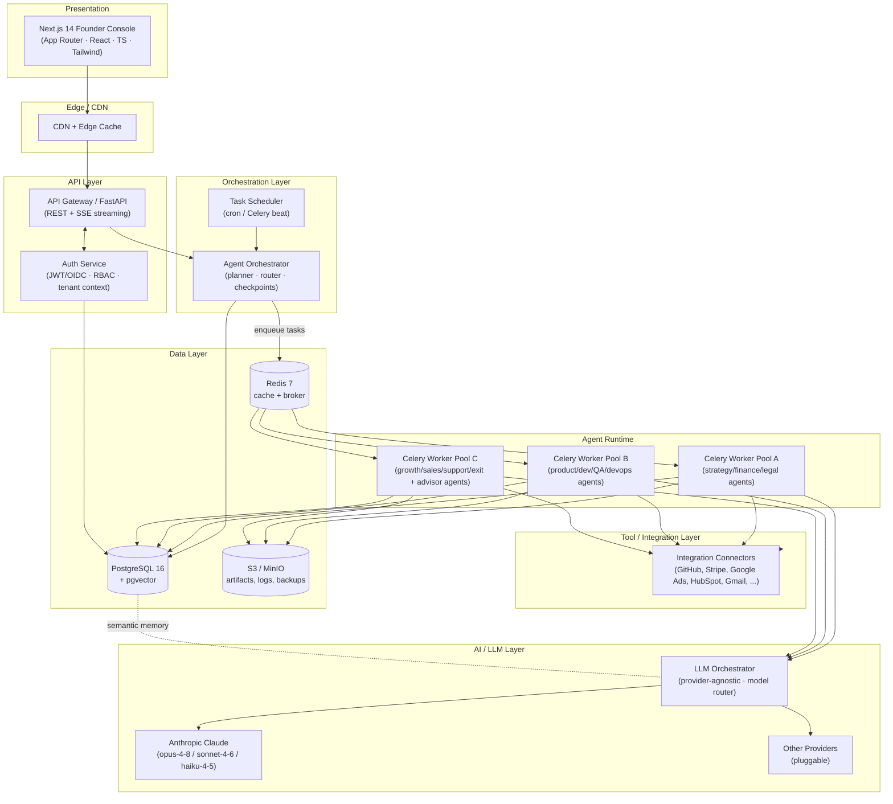
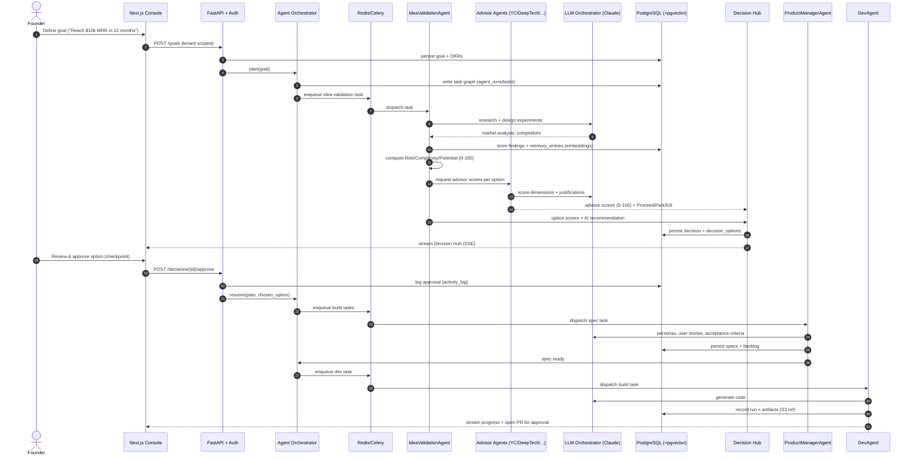
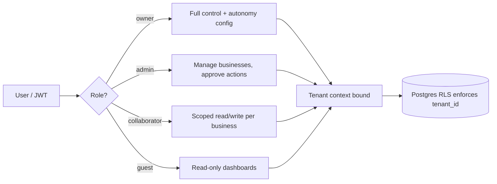
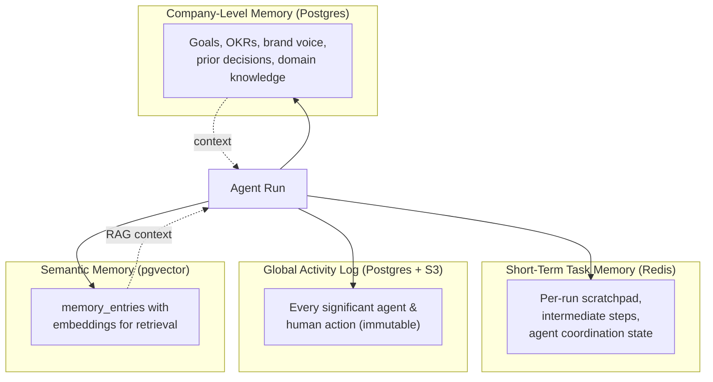

# System Architecture — MyUNO Capital

> **Autonomous AI Operating System for Solo Entrepreneurs (Idea → Exit).**
> This document describes the end-to-end system architecture of MyUNO Capital: the layers, the agent orchestration model, the memory architecture, multi-tenancy, reliability targets, observability, and scalability strategy.

**Related docs:** [Data Model](./data-model.md) · [Integrations Catalog](./integrations.md) · [Product Vision (`project.md`)](../project.md)

---

## 1. Architecture Overview

MyUNO Capital is a multi-tenant, agent-driven platform. A solo founder operates a **Founder Console** that talks to a **FastAPI** API layer, which delegates long-running work to an **Agent Orchestrator**. The orchestrator decomposes founder goals into tasks, queues them through **Redis/Celery**, and dispatches them to the **virtual team of agents** (IdeaValidationAgent, StrategyAgent, ProductManagerAgent, DevAgent, and the full roster from `project.md` §4.3–4.4). Agents call LLMs through a provider-agnostic orchestration layer and reach the outside world through the **Integration / Tool layer**. All durable state lives in **PostgreSQL 16 (with pgvector)**, with **Redis** for cache/queues and **S3-compatible object storage (MinIO local)** for artifacts.

---

## 2. Layer-by-Layer Breakdown

### 2.1 Presentation Layer — Next.js Founder Console

- **Stack:** Next.js 14 (App Router), React, TypeScript, Tailwind CSS.
- **Responsibilities:** the founder's "cockpit" — multi-business management, the Goal & Strategy layer, Autonomy & Approvals UI, dashboards, and the **Decision Hub** (options table with Risk / Complexity / Potential and advisor scores).
- **Real-time:** subscribes to **Server-Sent Events (SSE)** from FastAPI to render streaming agent progress and approval prompts. Long workflows surface incremental updates (per §6.3 latency targets).
- **Rendering:** React Server Components for dashboard reads; client components for interactive approvals. Static shell and assets served from the CDN/edge.

### 2.2 API Layer — FastAPI

- **Stack:** Python 3.12, FastAPI, Pydantic v2, SQLAlchemy 2.x.
- **API Gateway / FastAPI** is the single ingress for the console and webhooks. Responsibilities:
  - Request validation (Pydantic v2 schemas), pagination, error envelopes.
  - **Auth Service**: authenticates via JWT (and OIDC/SAML SSO on higher tiers per `project.md` §7.1), enforces **RBAC**, and injects the **tenant context** into every request (see §4).
  - Translates founder intents (e.g., "set goal", "approve decision") into orchestration commands.
  - Hosts SSE streaming endpoints and inbound integration **webhook** receivers.
- Stateless and horizontally scalable behind a load balancer; no business logic that blocks — long work is always handed to the orchestrator.

### 2.3 Orchestration Layer — Agent Orchestrator + Task Scheduler

- **Agent Orchestrator**: the brain that turns a founder goal into an executable plan.
  - **Planner:** decomposes a goal/OKR into a task graph (DAG) mapped to specific agents.
  - **Router:** selects the agent and the model tier for each task.
  - **Checkpoints:** inserts **human-approval checkpoints** based on the tenant's autonomy profile (§5.4).
- **Task Scheduler** (Celery beat): recurring jobs — metric refreshes, OpsAgent SOP runs, exit-readiness recomputation, integration token refresh, daily digests.

### 2.4 Agent Runtime

- Agents execute as **Celery tasks** across horizontally scalable worker pools (grouped by domain to tune resources and concurrency independently).
- Each agent is a typed unit with: a system prompt/playbook, an allow-listed tool set (Integration layer), a memory scope (§6), and an output contract (Pydantic v2) persisted to `agent_runs`/`tasks`.
- The roster maps directly to `project.md` §4.3–4.4: Strategy/Finance/Legal-lite, Product & Engineering, Growth/Marketing/Content, Sales/Success/Support, Ops/Data/Automation, Funding & Exit, plus the **Elite Advisor agents** (YC, Fintech/Product Excellence, Deep Tech, Moonshot, Global Ecosystem).

### 2.5 Tool / Integration Layer

- A uniform **connector interface** abstracts every third-party service (GitHub, Stripe, Google/Meta Ads, HubSpot, Gmail/SendGrid, Intercom/Zendesk, GA, Vercel, etc.).
- Provides capability discovery, **rate limiting**, retries, error normalization, fallbacks, and inbound **webhook** handling. Full catalog and the `Connector` base class are in [integrations.md](./integrations.md).

### 2.6 Data Layer

- **PostgreSQL 16 + pgvector** — primary relational store and semantic-memory vector store.
- **Redis 7** — cache, Celery broker/result backend, rate-limit counters, ephemeral short-term task memory.
- **S3 / MinIO** — artifacts (generated code bundles, reports, decks), agent logs, backups, data-room documents.
- Schema details in [data-model.md](./data-model.md).

### 2.7 AI / LLM Layer

- **Provider-agnostic LLM orchestrator** with a **model router**: routes each task to the cheapest model that meets the quality bar (cost/latency mitigation, `project.md` §12).
  - **`claude-opus-4-8`** — hard reasoning: architecture, strategy, advisor scoring, exit planning.
  - **`claude-sonnet-4-6`** — default workhorse: PM specs, content, code, analysis.
  - **`claude-haiku-4-5`** — high-volume/cheap: classification, extraction, routing, support triage.
- Default provider is **Anthropic Claude**; the interface is pluggable so other providers can be added without touching agent code.
- Supports tool calling (HTTP, DB, filesystem, repos, third-party APIs), structured outputs, prompt caching, and streaming.

### 2.8 Infrastructure Layer

- **Docker + Docker Compose** locally; **Kubernetes** in production.
- **Monorepo** layout: `frontend/`, `backend/`, `docs/`, `infra/`.
- **CI/CD:** GitHub Actions — build, test, image publish, migration gate, deploy.
- Secrets in a managed secret store (e.g., cloud secrets manager / sealed secrets); all transit over HTTPS/TLS.

---

## 3. Core Loop — Sequence Diagram

The first core loop (`project.md` §13): **Founder sets goal → Orchestrator plans → IdeaValidationAgent runs → Decision Hub scores → Founder approves → ProductManagerAgent + DevAgent build.**

---

## 4. Multi-Tenancy & Isolation

MyUNO Capital is multi-tenant by design (tens of thousands of solo founders, `project.md` §1.2, §6.2). A **tenant** maps to a founder's account; within a tenant there are multiple **businesses** (companies/projects).

### 4.1 Isolation Strategy (defense in depth)

1. **Application-layer tenant scoping (primary).** Every tenant-scoped table carries a `tenant_id` FK. The Auth Service resolves the tenant from the JWT and binds it to the request; the SQLAlchemy session sets `SET app.current_tenant` per transaction so all queries are automatically filtered. Cross-tenant access is impossible without an explicit, audited admin path.
2. **Postgres Row-Level Security (RLS).** RLS policies on tenant-scoped tables enforce `tenant_id = current_setting('app.current_tenant')::uuid` at the database, so a query bug cannot leak another tenant's rows. (See [data-model.md](./data-model.md) for the RLS note and DDL.)
3. **Per-tenant logical isolation for high tiers.** Studio/Incubator tenants can be provisioned with dedicated Postgres schemas and isolated worker queues/namespaces for stronger blast-radius control.
4. **Storage isolation.** S3/MinIO objects are namespaced by `tenant_id/business_id/...`; signed URLs are tenant-checked at issue time.
5. **LLM data isolation.** Customer data is never used to train shared models unless explicitly opted in (`project.md` §7.2). Per-tenant prompt context is assembled only from that tenant's memory.

### 4.2 RBAC

- Roles (stored on `memberships.role`): **owner** (founder), **admin**, **collaborator**, **guest/viewer** — extensible. SSO (SAML/OIDC) and MFA available on higher tiers (`project.md` §7.1).
- Permissions are checked at the API boundary (FastAPI dependency) and re-validated at the data layer via RLS. Autonomy profiles (§5.4) layer an additional **action-authorization** gate on top of RBAC for AI-initiated actions.

---

## 5. Agent Orchestration Model

### 5.1 Task queuing (Redis / Celery)

- The orchestrator writes a **task graph** to Postgres (`agent_runs`/`tasks`) and enqueues ready tasks onto **Celery** queues backed by **Redis 7**.
- Queues are partitioned by domain and priority (e.g., `agents.realtime`, `agents.build`, `agents.batch`) so interactive work is never blocked by long batch jobs. Worker pools (§2.4) scale per queue.
- Results and progress are written back to Postgres and streamed to the console via SSE.

### 5.2 Retries with exponential backoff

- Transient failures (LLM/provider errors, rate limits, connector 5xx) retry with **exponential backoff + jitter**: `delay = base * 2^attempt ± jitter`, capped at a max delay and a max attempt count.
- Permanent failures (validation errors, auth revoked) fail fast and surface to the founder with a clear remediation prompt.
- Dead-letter queue captures exhausted tasks for inspection.

### 5.3 Idempotency

- Every task carries an **idempotency key** (`tenant_id + business_id + task_signature`). Connector writes (e.g., creating a Stripe product, opening a GitHub PR, sending an outreach email) pass this key to the connector so retries never duplicate side effects.
- External side effects are recorded in `activity_log` before commit and reconciled on replay.

### 5.4 Human-approval checkpoints (autonomy profiles)

Per `project.md` §4.1, every tenant configures an **autonomy profile**; the orchestrator inserts approval checkpoints accordingly:

| Profile | Behavior | Checkpoints |
|---|---|---|
| **Ask me first** | Everything requires approval | Before every external/state-changing action |
| **Guided autonomy** | Small actions auto-run; big ones gated | Spend thresholds, prod deploys, payment/pricing changes, outreach sends |
| **Autonomous within limits** | Fully automatic inside budgets/guardrails | Only when a guardrail (budget, risk) is breached |

When a checkpoint triggers, the task pauses (state persisted), the console renders an approval card (often the Decision Hub), and on approval/rejection the orchestrator resumes or aborts the branch. Every decision and its reasoning are written to `activity_log` for trust, debugging, and exit due diligence.

---

## 6. Memory Architecture

- **Short-term task memory** — ephemeral per-run state in Redis for multi-step workflows and inter-agent coordination; expires when the run completes.
- **Company-level memory** — durable per-business knowledge in Postgres: goals, OKRs, brand voice, previous decisions, domain knowledge (`project.md` §5.2).
- **Global activity log** — append-only record of every significant agent and human action, used for debugging, trust, compliance, and exit due diligence. Backed by Postgres with long-term archival to S3.
- **Semantic memory (pgvector)** — `memory_entries` store text chunks plus vector embeddings (`vector(1536)`), enabling RAG: agents retrieve the most relevant company memory before each LLM call. Indexed with HNSW for low-latency similarity search (see [data-model.md](./data-model.md)).

---

## 7. Reliability, Observability & Performance

### 7.1 Reliability targets (`project.md` §6.3)

- **Uptime:** 99.9% for core APIs.
- **Latency:** simple tasks < 2s; complex workflows begin within 5–10s with streaming progress.
- **Durability:** all tasks persisted before execution; retries with exponential backoff (§5.2); idempotency (§5.3); point-in-time-recovery backups of Postgres and replicated S3.

### 7.2 Observability

- **Metrics:** Prometheus-style metrics (request rate/latency, queue depth, task success/failure, LLM token spend, connector error rates) → Grafana dashboards and SLO alerting.
- **Logs:** structured JSON logs shipped to a central store; correlated by `trace_id` and `tenant_id`.
- **Traces:** OpenTelemetry distributed tracing across console → FastAPI → orchestrator → workers → connectors/LLM, so a single founder action is traceable end-to-end.
- **Audit:** `activity_log` provides the human/AI action trail required for trust and exit due diligence.

### 7.3 Scalability

- **Horizontal worker scaling:** Celery worker pools autoscale on queue depth (Kubernetes HPA / KEDA) per domain queue.
- **Queue-based load handling:** spikes absorbed by Redis-backed queues; interactive queues prioritized over batch (§5.1).
- **Stateless API tier:** FastAPI scales horizontally behind a load balancer.
- **Data tier:** Postgres read replicas for dashboard/analytics reads; pgvector queries served from replicas; Redis clustered.
- **CDN / edge:** static assets and cacheable reads served from CDN/edge; region-aware deployments as the platform grows (`project.md` §6.2).

---

## 8. Cross-Cutting Concerns

- **Security:** HTTPS/TLS everywhere, encrypted secrets and integration credentials (see `integration_credentials` in [data-model.md](./data-model.md)), RBAC + RLS, MFA, audit logging (`project.md` §7).
- **Privacy:** per-tenant data export/deletion; no shared-model training without opt-in.
- **Cost control:** model routing across opus/sonnet/haiku, prompt caching, and result caching in Redis.
- **Failure isolation:** connector failures fall back gracefully and never crash the orchestrator; the Integration Abstraction Layer normalizes errors (see [integrations.md](./integrations.md)).
