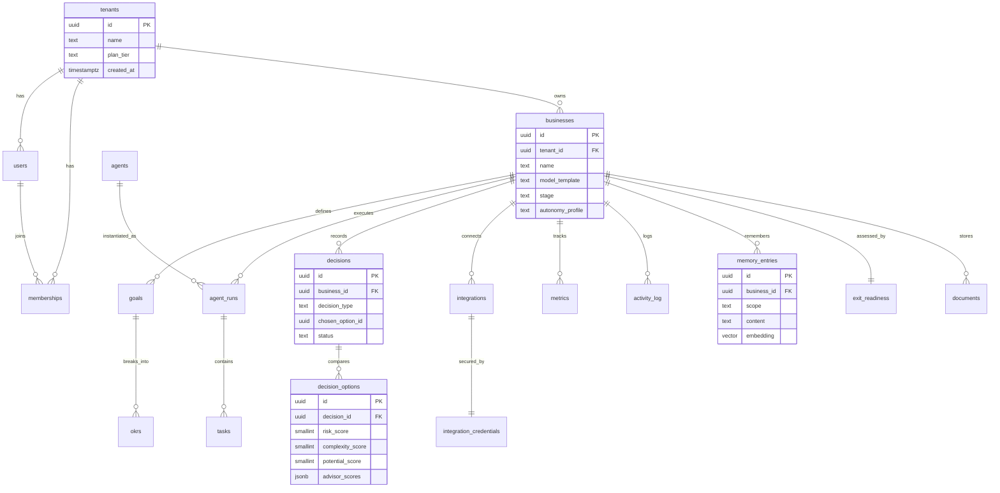

# Data Model — MyUNO Capital

> Database schema for the MyUNO Capital Autonomous AI Operating System. Built on **PostgreSQL 16 with the `pgvector` extension**, modeled with **SQLAlchemy 2.x** and migrated with **Alembic**.

**Related docs:** [System Architecture](./architecture.md) · [Integrations Catalog](./integrations.md) · [Product Vision (`project.md`)](../project.md)

---

## 1. Conventions

- **Primary keys:** `UUID` (`gen_random_uuid()` via `pgcrypto`).
- **Timestamps:** `created_at`, `updated_at` as `TIMESTAMPTZ` (UTC), default `now()`.
- **Multi-tenancy:** every tenant-scoped table carries `tenant_id UUID NOT NULL REFERENCES tenants(id)`. See [§5](#5-multi-tenancy-strategy).
- **Soft delete:** sensitive tables use `deleted_at TIMESTAMPTZ NULL`.
- **Money:** stored in minor units (`BIGINT` cents) with a `currency CHAR(3)`.
- **Scores:** Decision Hub Risk / Complexity / Potential and advisor scores are `SMALLINT` constrained to `0–100` (`project.md` §4.1.1, §4.4.2).

---

## 2. Entity Overview (ER Diagram)



---

## 3. Core Tables

### 3.1 `tenants`

The top-level account for a solo founder (or studio/incubator). Tenant of multi-tenancy.

| Column | Type | Notes |
|---|---|---|
| `id` | UUID PK | `gen_random_uuid()` |
| `name` | TEXT | Account / org display name |
| `plan_tier` | TEXT | `free` / `solo_starter` / `solo_pro` / `studio` (`project.md` §8.1) |
| `task_quota_month` | INT | Monthly task allowance for the tier |
| `status` | TEXT | `active` / `suspended` / `closed` |
| `created_at` | TIMESTAMPTZ | default `now()` |
| `updated_at` | TIMESTAMPTZ | default `now()` |

### 3.2 `users`

A person who can authenticate. A user may belong to multiple tenants via `memberships`.

| Column | Type | Notes |
|---|---|---|
| `id` | UUID PK | |
| `email` | CITEXT UNIQUE | Login identifier |
| `full_name` | TEXT | |
| `password_hash` | TEXT | Null if SSO-only |
| `mfa_enabled` | BOOLEAN | default `false` (`project.md` §7.1) |
| `sso_subject` | TEXT | OIDC/SAML subject, nullable |
| `last_login_at` | TIMESTAMPTZ | |
| `created_at` | TIMESTAMPTZ | |

### 3.3 `memberships`

Join table binding a user to a tenant with an RBAC role.

| Column | Type | Notes |
|---|---|---|
| `id` | UUID PK | |
| `tenant_id` | UUID FK → tenants | |
| `user_id` | UUID FK → users | |
| `role` | TEXT | `owner` / `admin` / `collaborator` / `guest` |
| `invited_by` | UUID FK → users | nullable |
| `created_at` | TIMESTAMPTZ | |
| | | UNIQUE `(tenant_id, user_id)` |

### 3.4 `businesses` (a.k.a. companies / projects)

A single business a founder runs inside a tenant. Multi-business is core (`project.md` §4.1).

| Column | Type | Notes |
|---|---|---|
| `id` | UUID PK | |
| `tenant_id` | UUID FK → tenants | |
| `name` | TEXT | |
| `model_template` | TEXT | `b2b_saas` / `ecommerce` / `productized_service` / `info_product` / `consulting` (`project.md` §4.2) |
| `stage` | TEXT | `ideation` / `validate` / `build` / `launch` / `grow` / `scale` / `exit_prep` / `exit` (`project.md` §11.1) |
| `autonomy_profile` | TEXT | `ask_first` / `guided` / `autonomous_within_limits` |
| `guardrails` | JSONB | e.g. `{ "ad_spend_daily_cap_cents": 10000, "require_deploy_approval": true }` |
| `brand_voice` | TEXT | Company-level memory |
| `created_at` | TIMESTAMPTZ | |
| `deleted_at` | TIMESTAMPTZ | soft delete |

### 3.5 `goals`

High-level objectives the founder sets; StrategyAgent turns them into OKRs.

| Column | Type | Notes |
|---|---|---|
| `id` | UUID PK | |
| `tenant_id` | UUID FK | |
| `business_id` | UUID FK → businesses | |
| `title` | TEXT | e.g. "Profitably reach $10k MRR in 12 months" |
| `description` | TEXT | |
| `target_date` | DATE | |
| `status` | TEXT | `active` / `achieved` / `abandoned` |
| `created_at` | TIMESTAMPTZ | |

### 3.6 `okrs`

Objectives & Key Results derived from a goal.

| Column | Type | Notes |
|---|---|---|
| `id` | UUID PK | |
| `tenant_id` | UUID FK | |
| `goal_id` | UUID FK → goals | |
| `objective` | TEXT | |
| `key_result` | TEXT | |
| `target_value` | NUMERIC | |
| `current_value` | NUMERIC | |
| `unit` | TEXT | `usd` / `pct` / `count` |
| `due_date` | DATE | |
| `status` | TEXT | `on_track` / `at_risk` / `off_track` / `done` |

### 3.7 `agents` (registry)

Catalog of available agent types (the virtual team, `project.md` §4.3–4.4). Global/system-seeded, not tenant-scoped.

| Column | Type | Notes |
|---|---|---|
| `id` | UUID PK | |
| `key` | TEXT UNIQUE | e.g. `idea_validation`, `product_manager`, `dev`, `yc_accelerator` |
| `display_name` | TEXT | e.g. "IdeaValidationAgent" |
| `category` | TEXT | `strategy` / `product_eng` / `growth` / `sales_support` / `ops_data` / `funding_exit` / `advisor` |
| `default_model` | TEXT | `claude-opus-4-8` / `claude-sonnet-4-6` / `claude-haiku-4-5` |
| `tool_scopes` | JSONB | allow-listed connector capabilities |
| `enabled` | BOOLEAN | |

### 3.8 `agent_runs` / `tasks`

`agent_runs` is one invocation of an agent toward a goal; `tasks` are the queued units within a run (the orchestrator's task graph, see [architecture.md](./architecture.md) §5).

**`agent_runs`**

| Column | Type | Notes |
|---|---|---|
| `id` | UUID PK | |
| `tenant_id` | UUID FK | |
| `business_id` | UUID FK | |
| `agent_id` | UUID FK → agents | |
| `goal_id` | UUID FK → goals | nullable |
| `status` | TEXT | `planned` / `running` / `awaiting_approval` / `succeeded` / `failed` / `cancelled` |
| `model_used` | TEXT | |
| `token_input` / `token_output` | INT | LLM usage for cost tracking |
| `started_at` / `finished_at` | TIMESTAMPTZ | |

**`tasks`**

| Column | Type | Notes |
|---|---|---|
| `id` | UUID PK | |
| `tenant_id` | UUID FK | |
| `agent_run_id` | UUID FK → agent_runs | |
| `parent_task_id` | UUID FK → tasks | DAG edge, nullable |
| `type` | TEXT | task kind |
| `payload` | JSONB | inputs |
| `result` | JSONB | outputs |
| `status` | TEXT | `queued` / `running` / `retrying` / `succeeded` / `failed` / `dead_letter` |
| `idempotency_key` | TEXT | dedupes side effects ([architecture.md](./architecture.md) §5.3) |
| `attempts` | SMALLINT | retry counter |
| `next_retry_at` | TIMESTAMPTZ | exponential backoff |
| `created_at` | TIMESTAMPTZ | |

### 3.9 `decisions`

A Decision Hub decision (idea, feature, channel, pricing, tech stack, exit timing, …). `project.md` §4.1.1.

| Column | Type | Notes |
|---|---|---|
| `id` | UUID PK | |
| `tenant_id` | UUID FK | |
| `business_id` | UUID FK | |
| `decision_type` | TEXT | `idea` / `feature` / `channel` / `pricing` / `tech_stack` / `market` / `funding` / `exit_timing` |
| `title` | TEXT | |
| `context` | TEXT | situation summary |
| `ai_recommendation` | TEXT | `proceed` / `proceed_with_constraints` / `park` / `kill` |
| `chosen_option_id` | UUID FK → decision_options | nullable until chosen |
| `status` | TEXT | `open` / `awaiting_approval` / `decided` / `superseded` |
| `decided_by` | UUID FK → users | nullable |
| `decided_at` | TIMESTAMPTZ | |
| `created_at` | TIMESTAMPTZ | |

### 3.10 `decision_options`

One option within a decision, carrying **Risk / Complexity / Potential (0–100)** and **advisor scores**. `project.md` §4.1.1 & §4.4.2.

| Column | Type | Notes |
|---|---|---|
| `id` | UUID PK | |
| `tenant_id` | UUID FK | |
| `decision_id` | UUID FK → decisions | |
| `option_name` | TEXT | e.g. "SaaS A" |
| `risk_score` | SMALLINT | `0–100`, higher = riskier |
| `complexity_score` | SMALLINT | `0–100`, higher = more complex |
| `potential_score` | SMALLINT | `0–100`, higher = more upside |
| `time_to_impact` | TEXT | e.g. "3–6 months" |
| `capital_required_cents` | BIGINT | rough cost to first milestones |
| `advisor_scores` | JSONB | per-advisor scores + narrative + call — see below |
| `ai_justification` | TEXT | reasoning narrative |
| `is_recommended` | BOOLEAN | AI's recommended option |

**`advisor_scores` JSONB shape** (`project.md` §4.4):

```json
{
  "yc_accelerator":     { "pmf_score": 80, "call": "build_now",   "note": "Strong retention signal." },
  "fintech_excellence": { "monetization_strength": 75, "call": "proceed", "note": "Clear upsell ladder." },
  "deep_tech":          { "tech_feasibility": 90, "call": "proceed", "note": "Maps to mature SOTA." },
  "moonshot":           { "moonshot_potential": 55, "call": "proceed_with_constraints", "note": "Medium 10x upside." },
  "global_ecosystem":   { "global_scale_ease": 85, "call": "proceed", "note": "Easy localization." }
}
```

> Risk/Complexity/Potential are first-class indexed columns (sortable in the Options Table). The five advisor dimensions are stored as JSONB because the advisor set is extensible and each advisor reports a different named dimension. The scoring formulas are in `project.md` §11.3.

### 3.11 `integrations`

A connected third-party service for a business (`project.md` §5.1). Catalog and connectors in [integrations.md](./integrations.md).

| Column | Type | Notes |
|---|---|---|
| `id` | UUID PK | |
| `tenant_id` | UUID FK | |
| `business_id` | UUID FK | |
| `provider` | TEXT | `github` / `stripe` / `google_ads` / `meta_ads` / `hubspot` / `gmail` / `sendgrid` / `intercom` / `google_analytics` / `vercel` … |
| `category` | TEXT | `dev_product` / `deploy_infra` / `payments` / `crm_sales` / `marketing_ads` / `email_comms` / `support` / `analytics` |
| `status` | TEXT | `connected` / `error` / `revoked` / `rate_limited` |
| `config` | JSONB | non-secret settings (account id, region) |
| `connected_at` | TIMESTAMPTZ | |

### 3.12 `integration_credentials` (encrypted)

Secrets for an integration, encrypted at rest. Never exposed via API.

| Column | Type | Notes |
|---|---|---|
| `id` | UUID PK | |
| `tenant_id` | UUID FK | |
| `integration_id` | UUID FK → integrations | UNIQUE |
| `auth_type` | TEXT | `oauth2` / `api_key` |
| `secret_ciphertext` | BYTEA | envelope-encrypted (KMS data key); tokens/keys |
| `key_id` | TEXT | KMS/envelope key reference |
| `access_token_expires_at` | TIMESTAMPTZ | for OAuth refresh scheduling |
| `scopes` | TEXT[] | granted scopes |
| `created_at` | TIMESTAMPTZ | |

### 3.13 `metrics`

Time-series business/product metrics (MRR, churn, CAC, LTV, signups, NPS) populated by DataAgent/FinanceAgent.

| Column | Type | Notes |
|---|---|---|
| `id` | UUID PK | |
| `tenant_id` | UUID FK | |
| `business_id` | UUID FK | |
| `metric_key` | TEXT | `mrr` / `churn_rate` / `cac` / `ltv` / `signups` / `nps` / `ad_spend` |
| `value` | NUMERIC | |
| `unit` | TEXT | `usd` / `pct` / `count` |
| `period_start` | DATE | |
| `period_end` | DATE | |
| `source` | TEXT | originating integration/agent |
| `recorded_at` | TIMESTAMPTZ | |

### 3.14 `activity_log`

Append-only global activity log: every significant agent and human action (`project.md` §5.2). Used for trust, debugging, compliance, and exit due diligence.

| Column | Type | Notes |
|---|---|---|
| `id` | UUID PK | |
| `tenant_id` | UUID FK | |
| `business_id` | UUID FK | nullable (tenant-level events) |
| `actor_type` | TEXT | `human` / `agent` / `system` |
| `actor_id` | UUID | user id or agent id |
| `action` | TEXT | e.g. `decision.approved`, `deploy.executed`, `outreach.sent` |
| `target_type` / `target_id` | TEXT / UUID | affected entity |
| `metadata` | JSONB | diff / details |
| `trace_id` | TEXT | correlates with traces ([architecture.md](./architecture.md) §7.2) |
| `created_at` | TIMESTAMPTZ | immutable |

### 3.15 `memory_entries` (semantic memory)

Vector-embedded company memory for RAG (`project.md` §5.2; pgvector).

| Column | Type | Notes |
|---|---|---|
| `id` | UUID PK | |
| `tenant_id` | UUID FK | |
| `business_id` | UUID FK | |
| `scope` | TEXT | `company` / `task` / `decision` / `support_kb` / `brand` |
| `source_type` / `source_id` | TEXT / UUID | provenance |
| `content` | TEXT | chunk text |
| `embedding` | VECTOR(1536) | pgvector; semantic search |
| `metadata` | JSONB | tags, tokens |
| `created_at` | TIMESTAMPTZ | |

### 3.16 `exit_readiness`

One assessment per business, maintained by ExitPlanningAgent (`project.md` §4.3.6, §11.1).

| Column | Type | Notes |
|---|---|---|
| `id` | UUID PK | |
| `tenant_id` | UUID FK | |
| `business_id` | UUID FK | UNIQUE |
| `overall_score` | SMALLINT | `0–100` (exit-ready ≥75) |
| `financials_score` | SMALLINT | `0–100` |
| `metrics_score` | SMALLINT | `0–100` |
| `documentation_score` | SMALLINT | `0–100` |
| `operational_stability_score` | SMALLINT | `0–100` |
| `notes` | TEXT | |
| `assessed_at` | TIMESTAMPTZ | |

### 3.17 `documents` / data room

Artifacts and due-diligence documents; binary stored in S3/MinIO, metadata here.

| Column | Type | Notes |
|---|---|---|
| `id` | UUID PK | |
| `tenant_id` | UUID FK | |
| `business_id` | UUID FK | |
| `kind` | TEXT | `tos` / `privacy_policy` / `pitch_deck` / `financial_model` / `data_room` / `report` / `artifact` |
| `title` | TEXT | |
| `storage_key` | TEXT | S3/MinIO object key (`tenant_id/business_id/...`) |
| `mime_type` | TEXT | |
| `size_bytes` | BIGINT | |
| `is_data_room` | BOOLEAN | included in exit data room |
| `created_by` | UUID | user or agent |
| `created_at` | TIMESTAMPTZ | |

---

## 4. Example DDL

The following are illustrative `CREATE TABLE` statements for six of the most important tables, including the pgvector column and indexes. (Production DDL is generated/managed by Alembic — see [§6](#6-migrations-with-alembic).)

```sql
-- Extensions
CREATE EXTENSION IF NOT EXISTS pgcrypto;   -- gen_random_uuid()
CREATE EXTENSION IF NOT EXISTS citext;
CREATE EXTENSION IF NOT EXISTS vector;     -- pgvector
```

```sql
-- 4.1 tenants
CREATE TABLE tenants (
    id               UUID PRIMARY KEY DEFAULT gen_random_uuid(),
    name             TEXT NOT NULL,
    plan_tier        TEXT NOT NULL DEFAULT 'free'
                       CHECK (plan_tier IN ('free','solo_starter','solo_pro','studio')),
    task_quota_month INTEGER NOT NULL DEFAULT 50,
    status           TEXT NOT NULL DEFAULT 'active'
                       CHECK (status IN ('active','suspended','closed')),
    created_at       TIMESTAMPTZ NOT NULL DEFAULT now(),
    updated_at       TIMESTAMPTZ NOT NULL DEFAULT now()
);
```

```sql
-- 4.2 businesses (companies / projects)
CREATE TABLE businesses (
    id               UUID PRIMARY KEY DEFAULT gen_random_uuid(),
    tenant_id        UUID NOT NULL REFERENCES tenants(id) ON DELETE CASCADE,
    name             TEXT NOT NULL,
    model_template   TEXT CHECK (model_template IN
                       ('b2b_saas','ecommerce','productized_service','info_product','consulting')),
    stage            TEXT NOT NULL DEFAULT 'ideation'
                       CHECK (stage IN ('ideation','validate','build','launch',
                                        'grow','scale','exit_prep','exit')),
    autonomy_profile TEXT NOT NULL DEFAULT 'ask_first'
                       CHECK (autonomy_profile IN
                       ('ask_first','guided','autonomous_within_limits')),
    guardrails       JSONB NOT NULL DEFAULT '{}'::jsonb,
    brand_voice      TEXT,
    created_at       TIMESTAMPTZ NOT NULL DEFAULT now(),
    updated_at       TIMESTAMPTZ NOT NULL DEFAULT now(),
    deleted_at       TIMESTAMPTZ
);
CREATE INDEX idx_businesses_tenant ON businesses (tenant_id) WHERE deleted_at IS NULL;
```

```sql
-- 4.3 tasks (orchestrator task graph)
CREATE TABLE tasks (
    id               UUID PRIMARY KEY DEFAULT gen_random_uuid(),
    tenant_id        UUID NOT NULL REFERENCES tenants(id) ON DELETE CASCADE,
    agent_run_id     UUID NOT NULL REFERENCES agent_runs(id) ON DELETE CASCADE,
    parent_task_id   UUID REFERENCES tasks(id) ON DELETE SET NULL,
    type             TEXT NOT NULL,
    payload          JSONB NOT NULL DEFAULT '{}'::jsonb,
    result           JSONB,
    status           TEXT NOT NULL DEFAULT 'queued'
                       CHECK (status IN ('queued','running','retrying',
                                         'succeeded','failed','dead_letter')),
    idempotency_key  TEXT NOT NULL,
    attempts         SMALLINT NOT NULL DEFAULT 0,
    next_retry_at    TIMESTAMPTZ,
    created_at       TIMESTAMPTZ NOT NULL DEFAULT now(),
    UNIQUE (tenant_id, idempotency_key)
);
CREATE INDEX idx_tasks_ready ON tasks (status, next_retry_at);
CREATE INDEX idx_tasks_run   ON tasks (agent_run_id);
```

```sql
-- 4.4 decisions
CREATE TABLE decisions (
    id                UUID PRIMARY KEY DEFAULT gen_random_uuid(),
    tenant_id         UUID NOT NULL REFERENCES tenants(id) ON DELETE CASCADE,
    business_id       UUID NOT NULL REFERENCES businesses(id) ON DELETE CASCADE,
    decision_type     TEXT NOT NULL
                        CHECK (decision_type IN ('idea','feature','channel','pricing',
                               'tech_stack','market','funding','exit_timing')),
    title             TEXT NOT NULL,
    context           TEXT,
    ai_recommendation TEXT CHECK (ai_recommendation IN
                        ('proceed','proceed_with_constraints','park','kill')),
    chosen_option_id  UUID,   -- FK added after decision_options exists
    status            TEXT NOT NULL DEFAULT 'open'
                        CHECK (status IN ('open','awaiting_approval','decided','superseded')),
    decided_by        UUID REFERENCES users(id),
    decided_at        TIMESTAMPTZ,
    created_at        TIMESTAMPTZ NOT NULL DEFAULT now()
);
CREATE INDEX idx_decisions_business ON decisions (business_id, status);
```

```sql
-- 4.5 decision_options (Decision Hub scores + advisor scores)
CREATE TABLE decision_options (
    id                    UUID PRIMARY KEY DEFAULT gen_random_uuid(),
    tenant_id             UUID NOT NULL REFERENCES tenants(id) ON DELETE CASCADE,
    decision_id           UUID NOT NULL REFERENCES decisions(id) ON DELETE CASCADE,
    option_name           TEXT NOT NULL,
    risk_score            SMALLINT CHECK (risk_score       BETWEEN 0 AND 100),
    complexity_score      SMALLINT CHECK (complexity_score BETWEEN 0 AND 100),
    potential_score       SMALLINT CHECK (potential_score  BETWEEN 0 AND 100),
    time_to_impact        TEXT,
    capital_required_cents BIGINT,
    advisor_scores        JSONB NOT NULL DEFAULT '{}'::jsonb,  -- per-advisor 0-100 + call + note
    ai_justification      TEXT,
    is_recommended        BOOLEAN NOT NULL DEFAULT false,
    created_at            TIMESTAMPTZ NOT NULL DEFAULT now()
);
CREATE INDEX idx_options_decision ON decision_options (decision_id);
CREATE INDEX idx_options_scores
    ON decision_options (potential_score DESC, risk_score ASC);

-- complete the decisions FK now that the table exists
ALTER TABLE decisions
    ADD CONSTRAINT fk_decisions_chosen_option
    FOREIGN KEY (chosen_option_id) REFERENCES decision_options(id);
```

```sql
-- 4.6 memory_entries (pgvector semantic memory)
CREATE TABLE memory_entries (
    id           UUID PRIMARY KEY DEFAULT gen_random_uuid(),
    tenant_id    UUID NOT NULL REFERENCES tenants(id) ON DELETE CASCADE,
    business_id  UUID NOT NULL REFERENCES businesses(id) ON DELETE CASCADE,
    scope        TEXT NOT NULL DEFAULT 'company'
                   CHECK (scope IN ('company','task','decision','support_kb','brand')),
    source_type  TEXT,
    source_id    UUID,
    content      TEXT NOT NULL,
    embedding    VECTOR(1536) NOT NULL,
    metadata     JSONB NOT NULL DEFAULT '{}'::jsonb,
    created_at   TIMESTAMPTZ NOT NULL DEFAULT now()
);
-- Approximate nearest-neighbor index for fast semantic retrieval (cosine distance)
CREATE INDEX idx_memory_embedding_hnsw
    ON memory_entries USING hnsw (embedding vector_cosine_ops);
-- Tenant/business filter index to keep ANN search tenant-scoped
CREATE INDEX idx_memory_scope ON memory_entries (business_id, scope);
```

---

## 5. Multi-Tenancy Strategy

- **Primary strategy:** shared schema with a `tenant_id` FK on every tenant-scoped table (all tables in [§3](#3-core-tables) except the global `agents` registry). Application code binds the tenant from the authenticated JWT and filters all queries; see [architecture.md](./architecture.md) §4.
- **Row-Level Security (RLS):** enable RLS on tenant-scoped tables as a database-enforced backstop so an application bug cannot leak cross-tenant data:

```sql
ALTER TABLE businesses ENABLE ROW LEVEL SECURITY;
CREATE POLICY tenant_isolation_businesses ON businesses
    USING (tenant_id = current_setting('app.current_tenant')::uuid);
-- The API sets the context per transaction:
--   SET LOCAL app.current_tenant = '<tenant-uuid>';
```

The same policy pattern is applied to `users`-linked tables, `goals`, `okrs`, `agent_runs`, `tasks`, `decisions`, `decision_options`, `integrations`, `integration_credentials`, `metrics`, `activity_log`, `memory_entries`, `exit_readiness`, and `documents`.

- **High-tier isolation:** Studio/Incubator tenants may be provisioned in **dedicated Postgres schemas** for stronger blast-radius control (see [architecture.md](./architecture.md) §4.1).

---

## 6. Migrations with Alembic

- **Tooling:** SQLAlchemy 2.x ORM models in `backend/` are the source of truth; **Alembic** autogenerates and versions migrations.
- **Workflow:**
  1. Edit ORM models.
  2. `alembic revision --autogenerate -m "add decision_options advisor_scores"`.
  3. Review the generated script (autogenerate does **not** detect everything — manually add pgvector index ops, RLS policies, `CHECK` constraints, and data backfills).
  4. `alembic upgrade head` locally → CI runs migrations against an ephemeral Postgres → deploy gate applies `alembic upgrade head` before rolling out new app pods.
- **pgvector & extensions:** the initial migration runs `CREATE EXTENSION IF NOT EXISTS vector;` (plus `pgcrypto`, `citext`). HNSW indexes are created with `op.execute(...)` since they are not auto-detected.
- **Zero-downtime:** additive, backward-compatible changes first (expand), deploy code, then contract in a later migration. Long index builds use `CREATE INDEX CONCURRENTLY` via `op.execute` outside a transaction.
- **Conventions:** every new tenant-scoped table's migration also enables RLS and adds the tenant-isolation policy ([§5](#5-multi-tenancy-strategy)).
