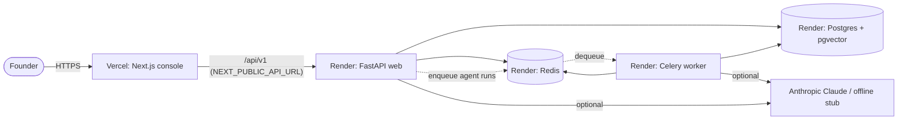

# Cloud Deployment — Vercel (frontend) + Render (backend)

This is the practical, hosted-deployment quickstart. For the self-hosted /
Kubernetes path see [deployment.md](./deployment.md); for local Docker see
[getting-started.md](./getting-started.md).

MyUNO Capital is two deployables:

| Part | Lives in | Host | Why |
|------|----------|------|-----|
| **Frontend** (Next.js console) | `frontend/` | **Vercel** | First-class Next.js hosting |
| **Backend** (FastAPI + Celery + Postgres/pgvector + Redis) | `backend/` | **Render** (or Railway/Fly) | Vercel is serverless and cannot run the worker, database, or Redis |

The two are wired together by exactly two settings:

- Frontend → backend: `NEXT_PUBLIC_API_URL` (set on Vercel) = the backend's public URL.
- Backend → frontend: `CORS_ORIGINS` (set on the backend host) = the Vercel domain.

---

## 1. Deploy the backend (Render)

The repo ships a [`render.yaml`](../render.yaml) Blueprint that provisions the
API, the Celery worker, managed PostgreSQL 16 (with `pgvector`), and Redis.

1. Push the repo to GitHub (already done on the working branch).
2. In Render: **New → Blueprint**, select `pavel949/myuno-capital`, **Apply**.
3. Render builds `backend/Dockerfile` for both the `web` and `worker` services,
   runs `alembic upgrade head` as the pre-deploy step, and boots the API.
4. (Optional) Seed demo data: open a shell on the `myuno-backend` service and run
   `python -m app.scripts.seed` (creates `founder@myuno.dev` / `ChangeMe123!`).
5. Copy the API URL, e.g. `https://myuno-backend.onrender.com`. Verify
   `GET /healthz` returns `{"status":"ok"}` and `/docs` loads.

Notes:
- **`DATABASE_URL`** is injected by Render as `postgres://…`; the backend
  normalizes it to the `postgresql+psycopg://` driver scheme automatically
  (`app/config.py`), so no manual rewriting is needed. This also makes Railway
  and Fly.io work out of the box.
- **`ANTHROPIC_API_KEY`** is optional. Without a real key the agents run against
  the deterministic offline stub, so the app is fully clickable; add a real key
  to get live Claude reasoning.
- **Object storage (S3/MinIO)** is optional for the demo. For production set
  `S3_ENDPOINT`, `S3_BUCKET`, `S3_ACCESS_KEY`, `S3_SECRET_KEY` to an S3 bucket
  or Cloudflare R2.
- Render's **free** Postgres/Redis plans have storage and uptime limits and the
  database expires after 90 days — use paid plans for anything real.

### Railway / Fly.io alternative
Both can build `backend/Dockerfile` directly. Provision managed Postgres
(enable the `vector` extension) and Redis, set the same env vars as in
`render.yaml`, run the API with
`uvicorn app.main:app --host 0.0.0.0 --port $PORT` and the worker with
`celery -A app.worker worker`. Run `alembic upgrade head` once on release.

---

## 2. Deploy the frontend (Vercel)

The repo ships [`vercel.json`](../vercel.json) that builds the `frontend/`
subdirectory.

### Option A — Dashboard (no secrets shared)
1. Vercel → **Add New… → Project → Import** `pavel949/myuno-capital`.
2. Set **Root Directory = `frontend`** (or leave root and let `vercel.json`
   drive the build — either works; Root Directory is the cleanest).
3. Add an environment variable
   `NEXT_PUBLIC_API_URL = https://myuno-backend.onrender.com`.
4. **Deploy.** Every push to the connected branch redeploys automatically.

### Option B — Vercel CLI
```bash
npm i -g vercel
vercel login
cd /path/to/MyUNO-Capital
vercel link                      # create/link the project
vercel env add NEXT_PUBLIC_API_URL production   # paste the backend URL
vercel --prod                    # deploy
```

---

## 3. Wire them together

1. On **Vercel**, set `NEXT_PUBLIC_API_URL` to the Render API URL and redeploy
   (Next.js bakes `NEXT_PUBLIC_*` at build time, so a redeploy is required).
2. On **Render**, set `CORS_ORIGINS` to your Vercel domain
   (e.g. `https://myuno-capital.vercel.app`) and redeploy the `myuno-backend`
   service.
3. Open the Vercel URL, register or log in with the seeded founder account, and
   confirm the dashboard, businesses, and Decision Hub load live data.

---

## Architecture (deployed)


