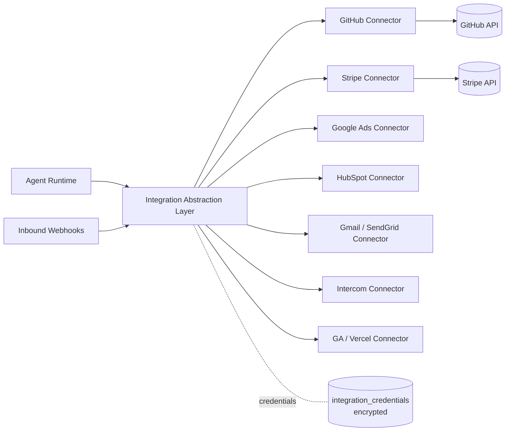

# Integrations Catalog — MyUNO Capital

> The catalog of third-party integrations that power the MyUNO Capital virtual team, organized by category (from `project.md` §5.1), plus the **Integration Abstraction Layer** that makes every connector uniform, reliable, and safe.

**Related docs:** [System Architecture](./architecture.md) · [Data Model](./data-model.md) · [Product Vision (`project.md`)](../project.md)

---

## 1. Overview

Agents never call third-party APIs directly. Every external service is wrapped in a **Connector** that conforms to a single interface (see [§10](#10-integration-abstraction-layer)). Connector configuration is stored in the `integrations` table and secrets in the encrypted `integration_credentials` table (see [data-model.md](./data-model.md) §3.11–3.12). Connectors expose typed **capabilities**, enforce **rate limits**, normalize **errors**, provide **fallbacks**, and handle inbound **webhooks**.



---

## 2. Development & Product

| Provider | Purpose | What the connector does | Auth | Used by |
|---|---|---|---|---|
| **GitHub / GitLab** | Source control & CI | Create branches, commit code, open/review PRs, read CI status, manage releases | OAuth 2.0 (app) / PAT | DevAgent, QAAgent, DevOpsAgent, ArchitectAgent |
| **Jira / Linear** | Issue & backlog tracking | Create/update issues, manage sprints, sync backlog priority, link PRs to tickets | OAuth 2.0 / API key | ProductManagerAgent, DevAgent, QAAgent |
| **Notion / Confluence** | Docs & knowledge base | Read/write specs, SOPs, knowledge-base articles; sync to company memory | OAuth 2.0 / API key | ProductManagerAgent, OpsAgent, SupportAgent, ContentAgent |

---

## 3. Deployment & Infrastructure

| Provider | Purpose | What the connector does | Auth | Used by |
|---|---|---|---|---|
| **Vercel / Netlify / Render** | App hosting & deploys | Trigger deploys, read build/deploy logs, manage env vars & domains, roll back | OAuth 2.0 / API token | DevOpsAgent, DevAgent |
| **AWS / GCP / Azure** | Cloud infra | Provision/manage compute, storage, DNS; read cost/usage; manage backups | OAuth/OIDC or scoped IAM keys | DevOpsAgent, ArchitectAgent, FinanceAgent (cost) |

> Deploys to production are gated by the autonomy profile (`require_deploy_approval`) — see [architecture.md](./architecture.md) §5.4.

---

## 4. Payments & Commerce

| Provider | Purpose | What the connector does | Auth | Used by |
|---|---|---|---|---|
| **Stripe** (MVP) | Payments, billing, revenue | Create products/prices, manage subscriptions, read charges & MRR, issue refunds, receive payment webhooks | OAuth 2.0 (Connect) / restricted API key | FinanceAgent, ProductManagerAgent, DataAgent, Fintech/Product Excellence advisor |
| **PayPal / Paddle / Shopify / WooCommerce** (later) | Alt payments & e-commerce | Read orders/payouts, manage catalog & checkout, sync revenue metrics | OAuth 2.0 / API key | FinanceAgent, DataAgent |

> Money-related actions enforce the highest reliability and approval standards (`project.md` §4.4.1 Fintech advisor).

---

## 5. CRM & Sales

| Provider | Purpose | What the connector does | Auth | Used by |
|---|---|---|---|---|
| **HubSpot / Pipedrive** | CRM & pipeline | Create/update contacts & deals, log activities, read pipeline stages, sync lead status | OAuth 2.0 | SalesAgent, SuccessAgent, MarketingStrategyAgent |
| **Built-in CRM** | Lightweight native CRM | Manage leads/contacts inside MyUNO Capital when no external CRM is connected | Native (no external auth) | SalesAgent, SuccessAgent |

---

## 6. Marketing & Ads

| Provider | Purpose | What the connector does | Auth | Used by |
|---|---|---|---|---|
| **Google Ads** | Search/display advertising | Create campaigns & ad groups, set budgets/bids, run A/B tests, read spend & conversions | OAuth 2.0 | AdsAgent, MarketingStrategyAgent, DataAgent |
| **Meta Ads** | Social advertising | Manage campaigns/creatives, audiences, budgets; read performance | OAuth 2.0 | AdsAgent, MarketingStrategyAgent |
| **LinkedIn Ads / TikTok Ads** (later) | B2B / short-video ads | Manage campaigns and read performance | OAuth 2.0 | AdsAgent |

> AdsAgent always respects strict budget guardrails; spend over the configured cap triggers a human-approval checkpoint (`project.md` §4.1, §4.3.3).

---

## 7. Email & Comms

| Provider | Purpose | What the connector does | Auth | Used by |
|---|---|---|---|---|
| **Gmail / Outlook** | Personal/business email + calendar | Read/send email, draft outreach, book calls into calendar | OAuth 2.0 | SalesAgent, SupportAgent, AcquirerOutreachAgent, OpsAgent |
| **SendGrid / Mailgun / Postmark** | Transactional & bulk email | Send sequences/transactional mail, manage templates, read deliverability & open/click events | API key | ContentAgent, MarketingStrategyAgent, SuccessAgent |
| **Slack / Microsoft Teams** | Team/founder notifications | Post status updates, approval prompts, alerts; receive slash-command actions | OAuth 2.0 | OpsAgent, DevOpsAgent, all agents (notifications) |

---

## 8. Support

| Provider | Purpose | What the connector does | Auth | Used by |
|---|---|---|---|---|
| **Intercom / Zendesk / Help Scout** | Customer support desk | Read/answer tickets & chats from the knowledge base, tag/route, escalate sensitive issues | OAuth 2.0 / API key | SupportAgent, SuccessAgent |

> SupportAgent learns from resolved tickets and writes them back to semantic memory (`memory_entries`, scope `support_kb`).

---

## 9. Analytics

| Provider | Purpose | What the connector does | Auth | Used by |
|---|---|---|---|---|
| **Google Analytics** | Web/product analytics | Read traffic, conversion, funnel & engagement metrics | OAuth 2.0 | DataAgent, MarketingStrategyAgent, IdeaValidationAgent |
| **Event tracking** | First-party product events | Ingest custom events; build MRR/churn/CAC/LTV/funnel dashboards | API key / native SDK | DataAgent, ProductManagerAgent |
| **Data warehouse (Postgres / BigQuery)** (optional) | Analytics warehouse | Run analytical queries, sync metrics, power advanced dashboards | API key / service account | DataAgent, FinanceAgent |

---

## 10. Integration Abstraction Layer

The abstraction layer (`project.md` §12, "Integrations/APIs break → integration abstraction layer; monitoring; fallbacks; integration testing") provides one uniform contract for all connectors.

### 10.1 Connector interface

- **Capability discovery** — each connector declares the typed operations it supports (`capabilities()`), so the orchestrator can route a task only to connectors that can fulfill it.
- **Rate limiting** — token-bucket limiter per `(provider, tenant)` backed by Redis; honors provider-published limits and `Retry-After` responses.
- **Error handling & fallbacks** — provider errors are normalized into a small typed hierarchy (`AuthError`, `RateLimitError`, `TransientError`, `PermanentError`); `TransientError`/`RateLimitError` are retried with exponential backoff + jitter ([architecture.md](./architecture.md) §5.2); on persistent failure a connector may declare a **fallback** (e.g., SendGrid → Mailgun, or queue-and-defer) so a single provider outage does not break a workflow.
- **Idempotency** — write operations accept an `idempotency_key` so retried tasks never duplicate side effects (charges, PRs, emails).
- **Webhook handling** — inbound webhooks (Stripe payments, GitHub PR events, ad conversions) hit a signed FastAPI endpoint; the layer verifies the signature, resolves the tenant/integration, normalizes the event, and emits it to the orchestrator and `activity_log`.

### 10.2 `Connector` base class (Python)

```python
from __future__ import annotations

import abc
from dataclasses import dataclass, field
from enum import Enum
from typing import Any


class ConnectorError(Exception):
    """Base for all normalized connector errors."""


class AuthError(ConnectorError):
    """Credentials missing/expired/revoked — surface to founder, do not retry."""


class RateLimitError(ConnectorError):
    """Provider throttled us; retry after `retry_after` seconds."""

    def __init__(self, message: str, retry_after: float = 1.0) -> None:
        super().__init__(message)
        self.retry_after = retry_after


class TransientError(ConnectorError):
    """Temporary failure (5xx, timeout) — safe to retry with backoff."""


class PermanentError(ConnectorError):
    """Non-retryable (4xx validation) — fail fast."""


class Capability(str, Enum):
    READ = "read"
    WRITE = "write"
    WEBHOOK = "webhook"


@dataclass(frozen=True)
class WebhookEvent:
    provider: str
    integration_id: str
    tenant_id: str
    event_type: str
    payload: dict[str, Any]


@dataclass
class ConnectorContext:
    """Tenant-scoped runtime context injected by the abstraction layer."""

    tenant_id: str
    business_id: str
    integration_id: str
    credentials: dict[str, Any]          # decrypted just-in-time, never logged
    config: dict[str, Any] = field(default_factory=dict)


class Connector(abc.ABC):
    """Uniform contract every third-party connector must implement."""

    provider: str                         # e.g. "stripe", "github"
    category: str                         # e.g. "payments", "dev_product"
    fallback_provider: str | None = None  # optional same-category fallback

    def __init__(self, ctx: ConnectorContext) -> None:
        self.ctx = ctx

    @abc.abstractmethod
    def capabilities(self) -> set[Capability]:
        """Typed operations this connector supports (for orchestrator routing)."""

    @abc.abstractmethod
    async def health_check(self) -> bool:
        """Verify credentials/connectivity; updates integrations.status."""

    @abc.abstractmethod
    async def execute(
        self,
        action: str,
        params: dict[str, Any],
        *,
        idempotency_key: str | None = None,
    ) -> dict[str, Any]:
        """
        Run a single capability action.

        Implementations MUST:
          - apply the per-(provider, tenant) rate limiter,
          - pass `idempotency_key` to the provider for write actions,
          - translate provider errors into ConnectorError subclasses,
          - never log raw credentials or PII.
        """

    async def handle_webhook(
        self,
        headers: dict[str, str],
        body: bytes,
    ) -> WebhookEvent:
        """Verify signature and normalize an inbound webhook. Override per provider."""
        raise NotImplementedError(f"{self.provider} does not support webhooks")
```

A concrete connector (e.g. `StripeConnector(Connector)`) sets `provider = "stripe"`, `category = "payments"`, implements `capabilities()`/`health_check()`/`execute()`, and overrides `handle_webhook()` to verify the Stripe signature and emit a normalized `WebhookEvent`. The abstraction layer wraps every `execute()` call with the rate limiter, retry/backoff policy, fallback resolution, and `activity_log` writes — so agent code stays provider-agnostic.

---

## 11. Adding a New Integration

1. Implement a `Connector` subclass under `backend/integrations/<provider>/`.
2. Declare `provider`, `category`, `capabilities()`, and (if applicable) `handle_webhook()` and `fallback_provider`.
3. Register the provider in the connector registry and add an Alembic seed/enum value if needed (see [data-model.md](./data-model.md) §6).
4. Add auth config (OAuth client or API-key onboarding) to the Founder Console connect flow.
5. Map which agents may use it via the `agents.tool_scopes` allow-list ([data-model.md](./data-model.md) §3.7).
6. Add integration tests (mocked provider) and a rate-limit profile.
